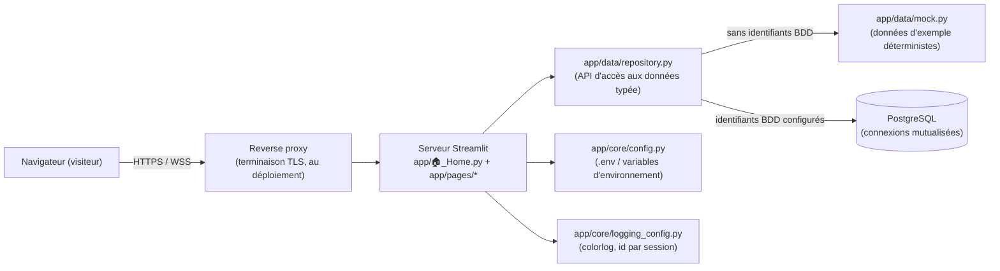

<p align="right"><a href="README.md">🇬🇧 English</a> · <strong>🇫🇷 Français</strong></p>

# ZEvent Dataviz


Tableaux de bord de modélisation de données pour le marathon caritatif de jeu
vidéo ZEvent — dons, streamers, jeux, et objectifs de dons, chacun sur sa
propre page Streamlit, alimentés par une connexion PostgreSQL mutualisée (via
PgBouncer) avec un jeu de données factices en secours pour le développement
local.

## Sommaire

- [Vue d'ensemble](#vue-densemble)
- [Architecture](#architecture)
- [Structure du projet](#structure-du-projet)
- [Démarrage](#démarrage)
- [Configuration](#configuration)
- [Pages](#pages)
- [Développement](#développement)
- [Sécurité](#sécurité)
- [Données et méthodologie](#données-et-méthodologie)
- [Philosophie de code](#philosophie-de-code)

## Vue d'ensemble

L'application est un petit ensemble de pages Streamlit ciblées, une par
thématique de modélisation de données, lisant une base PostgreSQL partagée
via une couche de dépôt (repository) typée. Tant que les identifiants réels
de la base ne sont pas fournis, chaque page fonctionne de bout en bout avec
des données d'exemple déterministes, ce qui permet de développer, relire et
présenter l'application hors ligne.

## Architecture



La couche de dépôt (repository) est la seule chose qui change lorsque la
vraie base de données est branchée — les pages ne parlent jamais directement
à la base de données ni aux données factices.

## Structure du projet

```
zevent-dataviz/
├── app/
│   ├── 🏠_Home.py                 # Point d'entrée Streamlit (page d'accueil)
│   ├── pages/                  # Une page par thématique de modélisation
│   │   ├── 1_📈_Donations.py
│   │   ├── 2_🎙️_Streamers.py
│   │   ├── 3_🎮_Games.py
│   │   ├── 4_🎯_Donation_Goals.py
│   │   ├── 5_💬_Live_Chat.py
│   │   ├── 6_👥_Community.py
│   │   └── 7_🏆_Donation_Tracker.py
│   ├── core/
│   │   ├── config.py            # Réglages : variables d'env / .env, jamais de secret en dur
│   │   ├── logging_config.py    # Configuration pilotée par logging.yml, id de session
│   │   ├── db.py                # Moteur SQLAlchemy mutualisé (st.cache_resource)
│   │   ├── i18n.py              # Sélecteur de langue EN/FR (t(), language_selector())
│   │   └── translations.py      # Le catalogue de chaînes EN/FR
│   ├── data/
│   │   ├── mock.py               # Données d'exemple déterministes
│   │   ├── goal_progress.py      # Calcul partagé début/fin/durée d'un objectif
│   │   └── repository.py         # API d'accès aux données (mock vs. Postgres)
│   └── components/
│       ├── theme.py              # Palette de graphiques & mise en page Plotly partagée
│       ├── chrome.py             # En-tête de page & bandeau source de données
│       └── network_graph.py      # Graphe de réseau à disposition dynamique (networkx + Plotly)
├── tests/                        # Suite de tests pytest
├── .streamlit/config.toml        # Configuration serveur & thème
├── .env.example                  # Variables d'environnement documentées (sans secret)
├── logging.yml                   # Profils de logs (development / production)
├── KARPATHY_GUIDELINES.md        # Philosophie de code de ce dépôt
└── CLAUDE.md                     # Instructions pour l'assistant IA sur ce dépôt
```

## Démarrage

Nécessite [uv](https://docs.astral.sh/uv/) et Python 3.14 (uv installe
l'interpréteur automatiquement).

```bash
git clone <ce-dépôt>
cd zevent-dataviz
uv sync                      # installe les dépendances dans .venv
cp .env.example .env         # renseigner les identifiants BDD une fois disponibles
uv run streamlit run app/🏠_Home.py
```

Sans identifiants de base de données dans `.env`, l'application fonctionne
immédiatement avec des données d'exemple — chaque page marche dès le départ.

## Configuration

Toute la configuration passe par des variables d'environnement (ou un
fichier `.env`), jamais en dur dans le code. Voir
[`.env.example`](.env.example) pour la liste complète ; les champs liés à la
base de données :

| Variable | Description | Valeur par défaut |
|---|---|---|
| `DB_HOST` | Hôte PostgreSQL/PgBouncer | _non défini → données factices_ |
| `DB_PORT` | Port PostgreSQL/PgBouncer | `5432` |
| `DB_NAME` | Nom de la base | _non défini_ |
| `DB_USER` | Utilisateur de la base (un rôle **lecture seule** est fortement recommandé) | _non défini_ |
| `DB_PASSWORD` | Mot de passe de la base | _non défini_ |
| `DB_POOL_SIZE` | Taille de base du pool de connexions | `5` |
| `DB_MAX_OVERFLOW` | Connexions supplémentaires autorisées en pic de charge | `10` |
| `DB_STATEMENT_TIMEOUT_MS` | Durée max qu'une requête peut retenir une connexion | `15000` |
| `APP_ENV` | `development` ou `production` — sélectionne aussi le profil [`logging.yml`](logging.yml) | `development` |

## Pages

Chaque page a un sélecteur de langue (EN/FR) dans la barre latérale, qui traduit tout le contenu de l'interface — voir `app/core/translations.py`.

| Page | Thématique |
|---|---|
| 📈 Donations | Dons cumulés, rythme horaire, répartition par phase, mouvements du classement, contrôle qualité |
| 🎙️ Streamers | Classement par dons/engagement/audience, avec filtres ; un nuage de points de corrélation ; détail du mix de fidélité des chatteurs et du profil horaire d'un streamer |
| 🎮 Games | Catégories jouées, audience simultanée sur la durée de l'événement, sessions de stream récentes, et un classement des titres de stream par messages/dons |
| 🎯 Donation Goals | Les objectifs de dons fixés par les streamers, par catégorie et par streamer, avec un histogramme des montants à seuil ajustable |
| 💬 Live Chat | Volume de messages et taux d'engagement dans le temps, une carte de chaleur chaîne×heure, chaînes les plus actives, emotes les plus utilisées |
| 👥 Community | Mix de fidélité et d'ancienneté des chatteurs, croissance cumulée des chatteurs, un graphe de réseau à disposition dynamique heure par heure des audiences partagées, chatteurs les plus actifs, paires de chaînes à audience partagée |
| 🏆 Donation Tracker | Suit le début/la complétion/la durée de chaque objectif de type « donation » — globalement sur tous les streamers, et par streamer, avec une chronologie façon Gantt |

La vraie base (schémas `raw`/`stg`/`int`/`marts`, modélisés avec dbt) n'a
aucune dimension « équipe » pour les streamers, qui sont donc classés
individuellement plutôt que groupés, et aucune donnée de sentiment/émotion —
le taux d'engagement du chat (messages/min/100 viewers) est le signal réel
le plus proche de « l'engouement ». Elle est alimentée par **deux pipelines
indépendants** : un pipeline de dons (le site ZEvent lui-même —
`mart_donations__*`, `mart_event__*`, `mart_donation_goals__*`) et un
pipeline de métadonnées/chat Twitch (`mart_streams__*`, `mart_chat__*`,
`mart_chatters__*`, `mart_community__*`). Le champ `game` du pipeline de dons
n'est pas alimenté avant le début de l'événement, donc la page Games lit
volontairement les catégories depuis le pipeline Twitch. Les noms d'utilisateur
du chat ne sont dans aucune table `raw.chat_messages_*` accessible à ce rôle,
mais sont récupérables via `int.int_chat__chatter_activity.chatter`, joint
par `chatter_id`. Voir le point d'extension
`app/data/repository.py::PostgresDataSource`.

## Développement

```bash
uv run ruff format .        # mise en forme
uv run ruff check . --fix   # linting (docstrings style Google exigées)
uv run ty check .           # vérification statique des types
uv run pytest               # tests
```

Les quatre commandes doivent passer avant qu'un changement soit considéré
comme terminé — voir [`CLAUDE.md`](CLAUDE.md) et
[`KARPATHY_GUIDELINES.md`](KARPATHY_GUIDELINES.md) pour les standards de code
de ce dépôt.

## Sécurité

Conçue pour, à terme, être exposée sur Internet public, donc :

- **Secrets** : uniquement dans des variables d'environnement / `.env`
  (ignorés par git) — jamais dans le code source, jamais dans les logs.
  Utiliser un rôle de base de données **lecture seule**.
- **Injection SQL** : chaque requête vers la vraie base utilise
  `sqlalchemy.text()` avec des paramètres liés ; aucune requête SQL n'est
  construite par concaténation ou formatage de chaînes dans ce dépôt.
- **Épuisement des connexions** : un seul `Engine` mutualisé et borné est
  partagé par toutes les sessions concurrentes (`st.cache_resource`), avec
  `pool_pre_ping` et `pool_recycle`. La base est derrière **PgBouncer**, donc
  `statement_timeout` est appliqué via un `SET` à chaque emprunt de connexion
  au pool plutôt qu'en paramètre de démarrage — PgBouncer ne transmet qu'une
  liste fixe de paramètres de démarrage et rejette les autres, et réappliquer
  ce réglage à chaque emprunt est aussi le bon comportement sous le mode de
  pooling par transaction de PgBouncer, où une session logique peut se voir
  attribuer une connexion backend différente entre deux transactions.
- **Charge sur la base** : les résultats de requête sont mis en cache côté
  serveur pour une courte durée (`st.cache_data`), afin que de nombreux
  visiteurs simultanés partagent une même requête plutôt que d'en déclencher
  une nouvelle à chaque fois.
- **CSRF / origine croisée** : `server.enableXsrfProtection` et
  `server.enableCORS` sont activés ; avant un déploiement public, configurer
  aussi `server.allowedHosts` avec le(s) vrai(s) domaine(s) — aucun des deux
  réglages seul ne restreint les connexions WebSocket cross-origin.
- **Surface d'erreur** : `client.showErrorDetails` est désactivé, un
  visiteur en production voit une erreur générique, jamais une pile
  d'exécution interne.
- **Logs** : structurés, horodatés, tagués avec un identifiant de session
  (pour distinguer les logs de visiteurs concurrents), répartis par niveau
  dans des fichiers compressés (gzip) avec rotation sous `logging/`
  (configuration dans [`logging.yml`](logging.yml)) — jamais d'identifiants
  ni de chaîne de connexion complète loggés.

## Données et méthodologie

Tant que les identifiants réels ne sont pas configurés, tous les chiffres
proviennent de `app/data/mock.py` — des données d'exemple clairement
déterministes, signalées par un bandeau visible sur chaque page.

Avec la vraie base connectée : les chiffres reflètent le pipeline de
l'événement tel qu'il est en ce moment, ce qui peut vouloir dire des
graphiques majoritairement à zéro/vides avant le vrai démarrage du ZEvent —
c'est exact, pas un bug. Deux points de vigilance :

- **Les montants des objectifs de dons ne sont pas des chiffres « argent
  réel » fiables.** Les streamers fixent eux-mêmes leurs montants d'objectif,
  et des blagues à plusieurs centaines de millions d'euros côtoient des
  objectifs sincères. La page Donation Goals affiche des comptages, pas des
  montants sommés, précisément pour cette raison.
- **Aucune dimension « équipe »** n'existe dans l'entrepôt de données — la
  page Streamers classe uniquement des individus.

## Philosophie de code

Voir [`KARPATHY_GUIDELINES.md`](KARPATHY_GUIDELINES.md) : lisibilité avant
ingéniosité, indirection minimale, pas de généralité spéculative. Les
assistants IA ne sont **jamais** listés comme co-auteurs des commits de ce
dépôt — voir [`CLAUDE.md`](CLAUDE.md).
