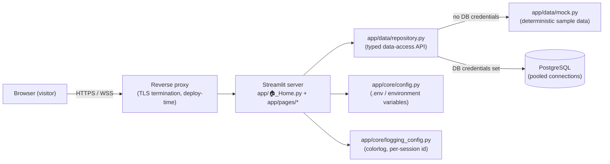

<p align="right"><strong>🇬🇧 English</strong> · <a href="README.fr.md">🇫🇷 Français</a></p>

# ZEvent Dataviz


Data-modeling dashboards for the ZEvent charity gaming
marathon — donations, streamers, games, and donation goals, each on its own
Streamlit page, backed by a pooled PostgreSQL connection (via PgBouncer) with
a mock-data fallback for local development.

## Table of contents

- [Overview](#overview)
- [Architecture](#architecture)
- [Project structure](#project-structure)
- [Getting started](#getting-started)
- [Configuration](#configuration)
- [Pages](#pages)
- [Development](#development)
- [Security](#security)
- [Data & methodology](#data--methodology)
- [Coding philosophy](#coding-philosophy)

## Overview

The app is a small set of focused Streamlit pages, one per data-modeling
topic, reading from a shared PostgreSQL database through a typed
repository layer. Until real database credentials are supplied, every page
runs end to end against deterministic sample data, so the whole app can be
developed, reviewed, and demoed offline.

## Architecture



The repository layer is the only thing that changes when the real database
is wired up — pages never talk to the database or to the mock data directly.

## Project structure

```
zevent-dataviz/
├── app/
│   ├── 🏠_Home.py                 # Streamlit entrypoint (landing page)
│   ├── pages/                  # One page per data-modeling topic
│   │   ├── 1_📈_Donations.py
│   │   ├── 2_🎙️_Streamers.py
│   │   ├── 3_🎮_Games.py
│   │   ├── 4_🎯_Donation_Goals.py
│   │   ├── 5_💬_Live_Chat.py
│   │   ├── 6_👥_Community.py
│   │   └── 7_🏆_Donation_Tracker.py
│   ├── core/
│   │   ├── config.py            # Settings: env vars / .env, never hardcoded secrets
│   │   ├── logging_config.py    # logging.yml-driven setup, per-session correlation id
│   │   ├── db.py                # Pooled SQLAlchemy engine (st.cache_resource)
│   │   ├── i18n.py              # EN/FR language switcher (t(), language_selector())
│   │   └── translations.py      # The EN/FR string catalog
│   ├── data/
│   │   ├── mock.py               # Deterministic sample data
│   │   ├── goal_progress.py      # Shared goal start/complete/duration computation
│   │   └── repository.py         # Typed data-access API (mock vs. Postgres)
│   └── components/
│       ├── theme.py              # Chart palette & shared Plotly layout
│       ├── chrome.py             # Page header & data-source banner
│       └── network_graph.py      # Force-directed network graph (networkx + Plotly)
├── tests/                        # pytest suite
├── .streamlit/config.toml        # Server & theme configuration
├── .env.example                  # Documented environment variables (no secrets)
├── logging.yml                   # Logging profiles (development / production)
├── KARPATHY_GUIDELINES.md        # Coding philosophy for this repo
└── CLAUDE.md                     # AI-assistant instructions for this repo
```

## Getting started

Requires [uv](https://docs.astral.sh/uv/) and Python 3.14 (uv installs the
interpreter automatically).

```bash
git clone <this-repo>
cd zevent-dataviz
uv sync                      # installs dependencies into .venv
cp .env.example .env         # fill in DB credentials once you have them
uv run streamlit run app/🏠_Home.py
```

Without database credentials in `.env`, the app runs immediately against
sample data — every page works out of the box.

## Configuration

All configuration is environment variables (or a `.env` file), never
hardcoded. See [`.env.example`](.env.example) for the full list; the
database fields:

| Variable | Description | Default |
|---|---|---|
| `DB_HOST` | PostgreSQL/PgBouncer host | _unset → mock data_ |
| `DB_PORT` | PostgreSQL/PgBouncer port | `5432` |
| `DB_NAME` | Database name | _unset_ |
| `DB_USER` | Database user (a **read-only** role is strongly recommended) | _unset_ |
| `DB_PASSWORD` | Database password | _unset_ |
| `DB_POOL_SIZE` | Base connection pool size | `5` |
| `DB_MAX_OVERFLOW` | Extra connections allowed under load | `10` |
| `DB_STATEMENT_TIMEOUT_MS` | Max time a single query may hold a connection | `15000` |
| `APP_ENV` | `development` or `production` — also selects the [`logging.yml`](logging.yml) profile | `development` |

## Pages

Every page has a language switcher (EN/FR) in the sidebar, translating all UI chrome — see `app/core/translations.py`.

| Page | Topic |
|---|---|
| 📈 Donations | Cumulative donations, hourly pace, event-phase split, leaderboard movers, data-quality check |
| 🎙️ Streamers | Rank by donations/engagement/audience, with filters; a correlation scatter; drill into a streamer's chatter-loyalty mix and hourly viewer pattern |
| 🎮 Games | Categories played, event-wide concurrent viewership over time, recent stream sessions, and a stream-title leaderboard by messages/donations |
| 🎯 Donation Goals | The milestone goals ("objectifs") streamers set for donations, by category and by streamer, with an adjustable-cutoff amount histogram |
| 💬 Live Chat | Chat message volume and engagement rate over time, a channel×hour activity heatmap, busiest channels, top emotes |
| 👥 Community | Chatter loyalty and account-age mix, cumulative chatter growth, an hour-by-hour force-directed network graph of shared audiences, most active chatters, shared-audience channel pairs |
| 🏆 Donation Tracker | Tracks each "donation"-type goal's start/completion/duration — globally across all streamers, and per streamer, with a Gantt-style timeline |

The real warehouse (`raw`/`stg`/`int`/`marts` schemas, dbt-modeled) has no
"team" dimension for streamers, so streamers are ranked individually rather
than grouped, and no sentiment/emotion data at all — the chat engagement
rate (messages/min/100 viewers) is the closest real proxy for "enthusiasm."
It's fed by **two independent pipelines**: a donations pipeline
(ZEvent's own site — `mart_donations__*`, `mart_event__*`, `mart_donation_goals__*`)
and a Twitch metadata/chat pipeline (`mart_streams__*`, `mart_chat__*`,
`mart_chatters__*`, `mart_community__*`). The donations pipeline's `game`
field isn't populated pre-event, so the Games page deliberately reads
categories from the Twitch pipeline instead. Chat usernames aren't in any
`raw.chat_messages_*` table this role can read, but ARE recoverable via
`int.int_chat__chatter_activity.chatter`, joined by `chatter_id`. See
`app/data/repository.py::PostgresDataSource` for the extension point.

## Development

```bash
uv run ruff format .        # formatting
uv run ruff check . --fix   # linting (Google-style docstrings enforced)
uv run ty check .           # static type checking
uv run pytest               # tests
```

All four must pass before a change is considered done — see
[`CLAUDE.md`](CLAUDE.md) and [`KARPATHY_GUIDELINES.md`](KARPATHY_GUIDELINES.md)
for the coding standards this repo holds itself to.

## Security

Designed to eventually run on the public internet, so:

- **Secrets** live only in environment variables / `.env` (gitignored) —
  never in source, never logged. Use a **read-only** database role.
- **SQL injection**: every real-database query uses `sqlalchemy.text()`
  with bound parameters; string-formatted SQL is not used anywhere in this
  codebase.
- **Connection exhaustion**: one pooled, bounded `Engine` is shared by every
  concurrent session (`st.cache_resource`), with `pool_pre_ping` and
  `pool_recycle`. The database sits behind **PgBouncer**, so `statement_timeout`
  is applied with a `SET` on every pool checkout rather than as a startup
  parameter — PgBouncer only forwards a fixed allowlist of startup parameters
  and rejects unknown ones outright, and re-applying it per checkout is also
  correct under PgBouncer's transaction-pooling mode, where a logical session
  can be handed a different backend connection between transactions.
- **Load on the database**: query results are cached server-side for a short
  TTL (`st.cache_data`), so many concurrent visitors share one query instead
  of each triggering a fresh round trip.
- **CSRF / cross-origin**: `server.enableXsrfProtection` and
  `server.enableCORS` are on; before deploying publicly, also set
  `server.allowedHosts` to the real domain(s) — neither setting alone
  restricts cross-origin WebSocket access.
- **Error surface**: `client.showErrorDetails` is off, so a production
  visitor sees a generic error, not an internal stack trace.
- **Logging**: structured, timestamped, tagged with a per-session id (so
  concurrent users' logs can be told apart), split by level into rotated,
  gzip-compressed files under `logging/` (config in [`logging.yml`](logging.yml)) —
  never logs credentials or full connection strings.

## Data & methodology

Until real credentials are configured, all figures come from
`app/data/mock.py` — clearly deterministic sample data, flagged with a
visible banner on every page.

With the real database connected: figures reflect the live event pipeline as
it stands, which may mean mostly zeros/empty charts before ZEvent actually
starts — that's accurate, not a bug. Two caveats worth knowing:

- **Donation-goal amounts are not reliable "real money" figures.** Streamers
  set their own goal amounts, and jokes in the hundreds of millions of euros
  exist alongside genuine ones. The Donation Goals page charts counts, not
  summed amounts, for exactly this reason.
- **No "team" dimension exists** in the warehouse — the Streamers page ranks
  individuals only.

## Coding philosophy

See [`KARPATHY_GUIDELINES.md`](KARPATHY_GUIDELINES.md): readable over
clever, minimal indirection, no speculative generality. AI assistants are
**never** listed as commit co-authors in this repository — see
[`CLAUDE.md`](CLAUDE.md).
